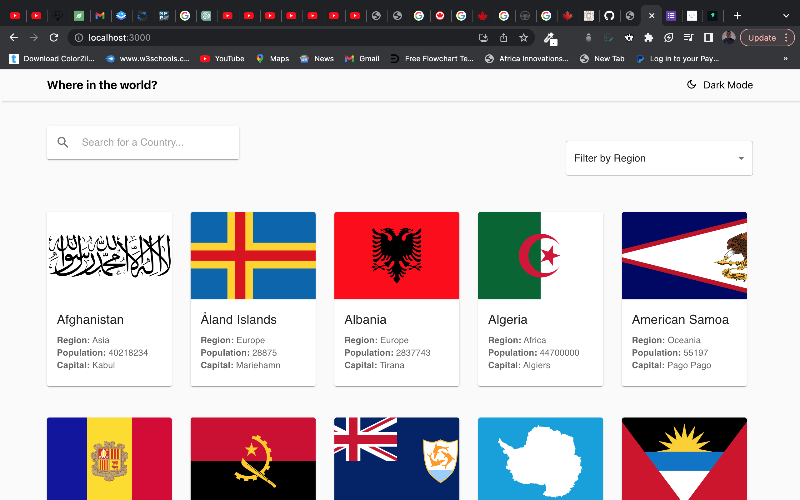

Country App Challenge - Frontend Mentor

This is an assignment from Frontend Mentor URL: https://www.frontendmentor.io/challenges/rest-countries-api-with-color-theme-switcher-5cacc469fec04111f7b848ca
that I have done in React Js a JavaScript frontend library.

# Set up 

## 1. Clone the repository

## 2. Open the file in your IDE eg VSCode and run the command below. This will install all the system dependencies for you.

      npm install

## 3. After installing all the application dependencies, Run the command npm start the server at URL: http://localhost:3000/

      npm start

## 4. Enjoy finding the details on your country of choice

## Screenshort

